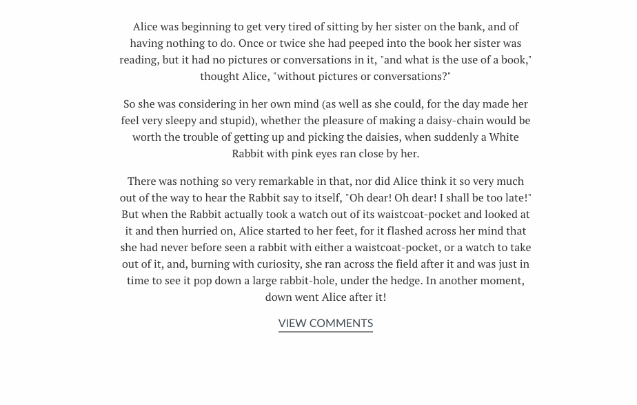

# JavaScript Events

## Learning Objectives

### Events

* Explain event-driven development
* Understand the different types of events we can work with in JS
* Setup an event listener and an event handler
* Use the event object

## Framing

Wouldn't it be nice if we could write code that allows elements on the webpage to respond to user interactions?

The **DOM** not only lets us manipulate the document (or webpage) using JavaScript, but also gives us the ability to write JavaScript that responds to interactions with the page. These interactions are communicated as **events**.

We can **listen** for certain kinds of user-driven events, such as clicking a button, entering data into a form, pressing a particular key on your keyboard, and more.

## Events

JavaScript typically will run top-to-bottom. As developers, however, we have no idea when the code related to the button-click will actually be executed. It's totally dependent on the user.

Therefore, we need to write code that will execute asynchronously — in other words, outside of the typical top-to-bottom document flow — and not hold up the rest of our application.

Once your JS has fully loaded, it lives in the background of your browser window, waiting and listening for any event triggers you've programmed.

As its name implies, in *event-driven programming*, the flow of a program is driven by events.

This means:

- The program continually "waits" or listens for events to occur.
- There are many kinds of events, such as mouse events, form events, key events, and document or window events.
- The event acts as a "trigger," which calls, or runs, a function.

### Turn & Talk: What is an Event?

But first, a question for you: What is an event (on a webpage)? Spend two minutes doing the following tasks. You are encouraged to discuss your findings with a partner during the exercise.

1. Come up with your own definition without looking at any other sources. Don't worry about getting it right — what do you think an event is?
2. Now, find (i.e., Google) some documentation on JavaScript events. Does that information match your definition? How would you change it?
3. Write down three examples of an event.

> You can find information on events and examples at [Mozilla Developer Network](https://developer.mozilla.org/en-US/docs/Web/Events).

### Types of Events

There are many events that can trigger a function. Here are a few:

|  Event | Description  |
|---|---|
|  `'load'` | When the page has finished loading.  |
|  `'resize'` |  When the browser window has been resized. |
|  `'scroll'` |  When the user scrolls up or down on a page. |
| `'click'`  | When the button (usually a mouse button) is pressed and released on a single element.  |
| `'mouseenter`' | When the user's mouse enters an element. |
| `'mouseleave'` | When the user's mouse leaves an element. |
| `'keydown'`  | When the user first presses a key on the keyboard.  |
|  `'keyup'` | When the user releases a key on the keyboard.  |
| `'focus'`  | When an element receives focus.  |
| `'blur'`  |  When an element loses focus. |
|  `'submit'` | When the user submits a form.  |

---
Now that we have an idea of what DOM events are in theory, let's wire up our code and begin interacting with them. There are two steps to working with events:
 
1. We set up an event listener with `.addEventListener`
2. We define an event handler, a callback function that get's passed to `.addEventListener`

### Step 1: Setting Up An Event Listener

In order to listen for an event, we need to define an **event listener**. Below you'll find a simple event listener associated with a `'click'` event on a `button` element.

First we target the button:

<details>
	<summary>If a button element has a class of 'js-button', how would we capture this from the DOM?</summary>

```js
const button = document.querySelector('.js-button');
```
</details>


Once we have the element from the DOM, we can tell JS to listen for an event:

```js
// This is the event listener

button.addEventListener('click', handleClickEvent);

// first argument: event
// second argument: callback function
```

### Step 2: Setting Up An Event Handler

For step two, we need to define the function that will be called whenever this event is emitted. This is just a function, but it has a special name due to how it's being used -- a **callback** function:

```js
function handleClickEvent() {
  console.log('I was clicked!');
}
```

Altogether, our code looks like this:

```js
const button = document.querySelector('.js-button');
button.addEventListener('click', handleClickEvent);

function handleClickEvent() {
  console.log('I was clicked!')
}
```

Or we could use an anonymous callback function:

```js
const button = document.querySelector('.js-button');

button.addEventListener('click', function() {
  console.log('I was clicked!');
});
```

<details>
	<summary>What is the code doing?</summary>
	
- The `button` refers to the DOM node to which we want to tie the event
- Then, it attaches an event listener to the `button` element with the `addEventListener()` method
- The `addEventListener()` method takes two arguments: 
 1. The event we want to listen for and 
 2. The function that should be called whenever that event is invoked. 
- In the case of the code above, we're saying we want to listen for `click` events on our `button`, and whenever someone does click on our button, call the `handleClickEvent()` function.
</details>

### Independent Practice - Color Scheme Switcher

It's time to get some practice in creating event handlers.

1. Open the [starter_code > color_scheme_switcher](starter_code/color_scheme_switcher) folder in your text editor.

2. Turn and Talk: Take a look at the code that has been provided to you in your `main.js` and `style.css`. What do you think will happen when the functions turnRed, turnWhite, turnBlue, and turnYellow run?

3. Add event handlers to the `main.js` file so that when a user clicks on one of the colored dots, the background color of the entire page changes to match that dot. You should not need to change any HTML or CSS.

### Code Along Exercise -- Simple Form

Say we've created a [simple form](examples/email_form) that allows users to subscribe to our email newsletter.

When the user tabs or clicks away from the email input field, we want to make sure the user has entered a value in the field.

Here we have a simple HTML snippet of an email form:

```html
<form>
	<h1>Email Form</h1>
	<input id="email" type="email" placeholder="Email Address">
	<button type="submit">Subscribe</button>
	<p id="message"></p>
</form>
```
The form contains an input field where the user can enter an email address, a button for submitting the form, and a paragraph with the id message that currently does not have any text inside of it.

Our stylesheet is also very basic.

Take a look at the class error, which will give a solid red border to any elements that have the error class.

```
.error {
    border: 2px solid #fa4542;
}
```
Now let's take a look at the event handler in our JS:

```js
// First in our JS, let's find the email input field.
const emailInputField = document.getElementById('email');

// Next up in our JS, let's add our event handler that will trigger the function when the user
// hits tab or clicks out of the email field (the 'blur' event).
emailInputField.addEventListener('blur', checkEmailInput);

// And finally in our JS, let's go ahead and set up that function we want to run when the blur event occurs, checkEmailInput:
function checkEmailInput () {

    // Check to see whether the user has entered a value to the email field.
    if (emailInputField.value.length === 0) {
        // If the email field is blank, display a message to the user.
        document.getElementById('message').innerText = 'Please enter an email address.'

        // Add an error class to the input field that will give it a red border.
        emailInputField.className = 'error';
    } else {
        //Otherwise, clear out the error message.
        document.getElementById('message').innerText = '';

        // Remove the error class from the input field
        emailInputField.className = '';
    }

}
```

Let's examine what the page looks like when the user hits the tab key or clicks away from the email field without entering any information.


The email input now has the `error` class, giving the input field a red border.

We've also added a message in the paragraph with the id `message`, alerting the user that they need to enter an email address.

### Independent Practice - Adding Event Handlers

It's time to get some practice in creating event listeners.

1. Open the [starter_code/event_listener_practice](starter_code/event_listener_practice) folder in your text editor. We've provided you with three files: index.html, style.css, and main.js.

2. Your job is to add event handlers to create the following functionality:

 - When the user hovers a mouse cursor over the `<div>`, the background of the page should turn blue.
 - When user's mouse cursor is no longer hovering over the `<div>`, the background of the page should turn white.
3. You have been provided with two functions — `changeBackgroundColorToBlue` and `changeBackgroundColorToWhite` — that can be used as callbacks. You do not need to change the content of these functions.


## This

As we saw earlier in this unit, the keyword `this` refers to the object that "owns" the function that the executed code runs within. It's important to remember that, when we have a method that is inside an object, this refers to the object that contains that method.

However, when a callback function is executed within the context of an event handler, it is the element (the DOM node) that owns the context.

So in this case, this will refer to the element that we selected when we set up our event handler.

Let's look at an example where we'll change the background color of a circle from blue to red, just by clicking on it:

##### HTML
```html
<div class="circle"></div>
```
##### JAVASCRIPT
```javascript
document.querySelector('.circle').addEventListener('click', turnRed)

function turnRed () {
	this.style.backgroundColor = "red";
}
```
When we click on the circle and trigger the turnRed function, this will refer to the element with the class circle within the turnRed function.

Here's what that looks like in action:


Okay, but why use the keyword `this`:

`this.style.backgroundColor = "red";`

Instead of just writing:

`document.querySelector('.circle').style.backgroundColor = "red";`

Well, let's imagine that there are several circles on our page, and we only want the `.circle` that we just clicked to have the updated red background color. That is where the `this` keyword really becomes useful.

Let's take a look:

```js
//Select all elements with the class .circle on the page
const circles = document.querySelectorAll('.circle');

//loop through each .circle element and add an event handler.
for (let i = 0; i < circles.length; i++) {
	circles[i].addEventListener('click', turnRed);
}

function turnRed () {
	this.style.backgroundColor = "red";
}
```

Here we are adding an event handler to each element with the class `.circle`.

When an element with the `.circle` class is clicked, the `turnRed` function will be called; within that `turnRed` function, `this` will only refer to the `.circle` that triggered the `turnRed` function, and not to any of the other circles.

Let's see this in action:


See how we are only adding the style attribute to the circle we are currently clicking on (i.e., the one that triggered the callback function)? Pretty cool, huh?

## Independent Practice: This  
It's time to get some practice in creating using the `this` keyword.

Work through this exercise with a partner.

- Open the [starter_code/color\_scheme\_switcher\_part\_2](starter_code/color_scheme_switcher_part_2) folder in your text editor. We've provided you with three files: `index.html`, `style.css`, and `main.js`.
- Follow the instructions in the `main.js` file.
- You should only need to write code within the `switchTheme` function.

**Challenge Instructions (for advanced students)**

Want to try your hand at this exercise with a little less guidance?

- Open the [starter\_code > color\_scheme\_switcher](starter_code/color_scheme_switcher) folder in your text editor that you were working from earlier.
- Refactor the code using the following guidlines:
	- Use `querySelectorAll` to select all `li`s on the page.
	- Loop through all list items and add an event listener to each. When a `li` is clicked, call the `switchTheme` function.
	- Create the `switchTheme` function. When the function runs, use the `this` keyword to get the className on the button that was just clicked and update the className on the body to that class.

---

## The Event Object

Now that we've gotten the hang of writing event handlers, let's talk a bit about the event object.

When an event occurs, we might want to find out some information about it. For example, which element did the user interact with to cause the event? What type of event was it? A click event? A mouseover?

To obtain this information, we use the **event object**.

### Explore The Event Object

Open up your event listener practice exercise and modify your event handler to accept the event object as a parameter. Then log it to the console.

With your partner, spend three minutes clicking the button and exploring what properties the event (or `e`) object contains. Look for:

* A way to figure out what element was clicked on.
* A way to tell the position of the mouse when it was clicked.
* One other piece of useful or interesting information.

> The reason we're not actually using `event` is that it's a "reserved word" in Javascript, like "if" and "return".

Examine what the event object looks like when you log it to the console, and notice all of the properties we have available to us as part of the event object:


We'll take a look at a few of these properties, but for now, just note how much information about the event the event object holds.

### Preventing Default Behavior

The event object is useful to us as programmers for many reasons - one of those reasons is preventing the default browser behavior for a certain event.

A very common use case for this is when the user clicks on an anchor element (`<a>`) but we want to control what happens in our code, rather than rely on what the browser tries to do in response to this event by default (navigate to another location).

For example:

To prevent the default behavior, we have a special method inside the event object: `preventDefault()`.

- How do we call methods on objects?
- How might we then invoke `preventDefault()` to prevent the default browser behavior?

<details>
	<summary> Answer </summary>

```js
const button = document.querySelector('.js-button');

button.addEventListener('click', handleClickEvent);

function handleClickEvent(e) {
	e.preventDefault();
   console.log('I was clicked!');
   console.log(e);
}
```
</details>

Another example:

Maybe when a user clicks on a link or submits a form, we don't want to take them to another page.

Instead, we want to fade in some comments.

To do that, we could type:

**HTML:**

```html
<a href="#">View Comments</a>
```

**JS:**

```js
document.querySelector('a').addEventListener('click', viewComments);


function viewComments (e) {
	// Add a class that fades the comments in by changing the opacity to 1
	document.querySelector('#comments').className = 'show-comments';
}
```

Our comments are added at the bottom as we had intended, but we don't want the page to jump to the top!


We want to override the default functionality of a link, and have comments appear instead of taking the user to another page.


To prevent this default behavior, we can use the `preventDefault()` method:

```js
document.querySelector('a').addEventListener('click', viewComments);

function viewComments (e) {
	// Prevent page from jumping to top.
	e.preventDefault();

	document.querySelector('#comments').className = 'show-comments';
}
```

Again, we're passing the event object as a parameter to our callback function.


Notice how, within the function, we called the preventDefault method on the event object using dot notation:

`e.preventDefault();`

Let's take a look at the result:




You'll often use this method when you have _anchors_ or _submit buttons_ on a page that you want to provide with some JavaScript functionality, instead of having them take you to another page.

### Event Propagation

Given the following scenario and what we've learned about events so far, what would you do?

> You have a `<nav>` element that contains an unordered list with links in the header of your website. This `<nav>` serves as the primary navigation. Whenever the user clicks on one of these links however, you want to run some code and update the page with JavaScript. How would you attach and event to each link in the list?

One way to go about this is to set an individual event listener on each link, as we did in the color switcher example above.

Another way to go about this is to take advantage of event propagation. There are three phases of **event propagation**: capture phase, target phase, and bubbling phase.

Let's take a look:


```js
function addAnchorMessage (e) {
  e.stopPropagation();
  document.querySelector('body').appendChild = 'Anchor has been clicked';
}
```

Again, we pass in the event object as a parameter, "e".

We then access the `stopPropagation()` method using dot notation. This prevents the event from bubbling up to any ancestors.

When we click on an anchor, we don't see messages appended for each ancestor element, since those events are no longer being triggered:


When an event (e.g. click) occurs, all nodes up the DOM tree are notified, beginning at the window level and working its way down the DOM branch to the event target. This is the capture phase. Once the propagation reaches the event target, all event listeners on the target will be triggered. Then, event propagation continues back up the DOM tree in the event bubbling phase. All three of these phases are very nearly instantaneous.

Consider the event propagation flow phase illustration below:


Going back to our example with the `<nav>` element containing links: Given event propagation, you can put an event listener on the `<nav>` element. When a click event occurs on each child `<a>`, the event will propagate up through all parent elements of that `<a>` element, including the `<nav>` element. Thus, the event listener on the `<nav>` element will be triggered.

To trigger specific outcomes for each event target child element, you can use a conditional (if/else) or switch statement to invoke the intended function for each the event target.

### target

We can use dot notation to access those properties, as we did when working with objects.

```js
document.querySelector('a').addEventListener('click', viewComments);

function viewComments (e) {
	// To access a property of the event object, we can use dot notation:
	var eventTarget = e.target;
	// Log the target to the console
	console.log(eventTarget);

}
```

Here we access the target of the event by using dot notation e.target. Then we log the target to the console.

Let's take a look at what we see in the console:

```html
<a href="#">View Comments</a>
```

Aha! That's the target of the event, or the element we clicked on that caused the event to fire.

## Additional Topics

### Event Flow (If time permits)

Now that we have a good feel for what the event object is, let's go ahead and look at a concept that is central to event handling in JavaScript: event flow.

We've seen in the past that HTML elements can be nested inside other HTML elements. When we say "nested," we mean that one element can wrap another element.

Take a look at a quick refresher:

```html
<h1>Popular memes for 2016</h1>

<ul>
	<li><a href="">Hotline Bling</a></li>
	<li><a href="">Katy Perry's Left Shark</a></li>
	<li><a href="">Lil Mama Crying</a></li>
	<li><a href="">Pizza Rat</a></li>
	<li><a href="">What's Good?</a></li>
</ul>
```

Here we have a `ul` wrapping five `li`. Each `li`, in turn, is wrapping an anchor.

In other words, we could say that each `a` is nested inside of an `li`, and each `li` is nested inside the `ul`.

When we hover over an anchor and click on it, JS can trigger any events that are tied to the anchor, as well as any events that are tied to any elements the `a` is nested within (i.e., the `li` it sits within; the `ul` it is also nested within).

If we zoom out a bit and remember the DOM tree, we will recall that our `ul` is nested inside the `body`, which is nested inside the `html`, which is nested inside the document object.

Events that are bound to any of these elements will trigger when we click on the `a`.


The order in which these events fire is called **event flow**.

### Event Bubbling

**Event bubbling** is when the event starts at the most specific element node and then flows outwards toward the least specific node.


Here the event will start at the `a`, the most specific node, and then work its way outward, triggering any events that might be tied to the `li`, then the `ul`, then the `body`, then finally, the `document` (in this case, the HTML doc).

#### Why does this matter?

Understanding event flow comes into play when the code has event handlers that are tied to the element that triggers the event, as well as any of its ancestors or descendants.

Take a look at our example from before. We've gone ahead and tied an event handler to the `a`, `li`, `ul`, `body`, and `document` elements that append a paragraph element to the body that states "[element name] has been clicked."


The order in which those messages are appended to the body: "Anchor has been clicked" is appended first, and "Document has been clicked" is appended last, since the events are flowing outwards from the most specific element.

The key concept here is that _events are triggered not only for the element that we tie the event handler to, but also for any elements that element is nested inside of_.

The flow in which these events happens is from the _most specific_ element to the _least specific_ element (outwards in the diagram).

### Key Events (If time permits)

Let's explore some other events.

Open [starter\_code/key\_events](starter_code/key_events) in your text editor.

#### Independent practice

With a partner, take a look at the code that has been provided in `main.js`. Explore the `event` object again. **Can you find a way to tell which key was pressed?**

#### Guided Practice - Key Events

> The `keyCode` property is a cross-browser way of telling which key is pressed. For `d`, `evt.keyCode` is `68`. For Shift, it's `16`.

#### Independent Practice

Find the keyCodes for:

* Enter
* Tab
* Delete

#### Independent Practice

There are several other events that come up with the `input` tag. See if you can figure out the difference between the following events:

* `keyup`
* `keydown`
* `keypress`
* `change`
* `focus`
* `blur`

> If you want to test out more JavaScript events, an extensive list can be found [here](https://developer.mozilla.org/en-US/docs/Web/Events).

### Multiple Events (If time permits)

There may be instances where we want to trigger multiple functions when an event occurs.

For example, when our user clicks the "submit" button, maybe we want to run a function that will check to see if the form is valid and call another function that will display a "loading" icon.

In a case like this, we'd have multiple event handlers for one event.

To trigger multiple functions, first define the functions that you want to be called when our event occurs.

For example, on the next slide, we define two functions: `showLoadingIcon()` and `checkEmailInput()`.

```js
function showLoadingIcon() {
  document.getElementById('loading').style.display = "block";
}
function checkEmailInput() {
  var emailInputField = document.querySelector('input');
    // Check to see whether the user has entered a value to the email field.
    if (emailInputField.value.length === 0) {
      // If the email field is blank, display a message to the user.
      document.getElementById('message').innerText = 'Please enter an email address.'
      // Add an error class to the input field that will give it a red border.
      emailInputField.className = 'error';
    } else {
      // Otherwise, clear out the error message.
      document.getElementById('message').innerText = '';
      // Remove the error class from the input field
      emailInputField.className = '';
    }
}
```

Alternatively, you could write something like this, which should still get the point across:


```js
function showLoadingIcon() {
  // Code to show the loading icon
}

function checkEmailInput() {
  // Code that checks to see if the user entered an email address
  // And adds a red border to the input and an error message if not.
}
```

We'll then need to **define a third function**, which will contain the previous two functions:

```js
function submitForm() {
  showLoadingIcon();
  checkEmailInput();
}
```

Finally, we'll assign that third function as the event handler:


```js
document.getElementById('submit').addEventListener('click', submitForm);
```

Lets recap the steps before we move on:

1.  Start with input and button elements (in our HTML).

3.  Attach an event listener to the button.

5.  Invoke two functions within the event handler.

*   The first function displayed the loading icon.
*   The second function validated the email address.

***

## You Do: Traffic Light and DOTS: The Game

1. In the traffic light directory, implement the JavaScript required to get the traffic light to illuminate the correct light when the corresponding button is pressed. **Note**: Only one light should be on at a time!

2. Visit this [repository](https://git.generalassemb.ly/WDI-Epiphany/event-listener-demo) and follow the instructions.

## Additional Reading
- Videos
 - [Philip Roberts: What the heck is the event loop anyway?](https://www.youtube.com/watch?v=8aGhZQkoFbQ)
 - [Build a Drum Kit in Vanilla JS](https://www.youtube.com/watch?v=VuN8qwZoego)
- Readings
 - Eloquent JavaScript [Handling Events](http://eloquentjavascript.net/15_event.html)
 - [Event reference](https://developer.mozilla.org/en-US/docs/Web/Events)
 - [Introduction to events](https://developer.mozilla.org/en-US/docs/Learn/JavaScript/Building_blocks/Events)
