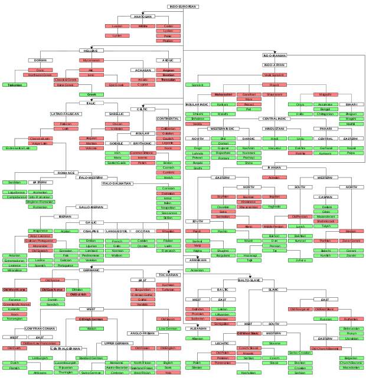

# Language Families


Folders. Inside folders. Inside folders. With pieces of text in them.


1. Create a folder `indo-european`.
> paste command here
2. Enter `indo-european`.
> paste command here
3. Create a file `latin.txt`, and add the text: 'quid una PC'.
(Try doing this in one line!)
> paste command here
4. Create a folder `germanic`.
> paste command here
5. Create a folder `romance`.
> paste command here
6. Enter `germanic`.
> paste command here
7. Create a file `icelandic.txt`, and add the text: 'Við spiluðum í heimsmeistarakeppninni'.
> paste command here
8. Create a file `norwegian.txt`, and add the text: 'Befolkningen i vår største by er 1 million'.
> paste command here
9. Create a folder `anglo-frisian`.
> paste command here
10. Create a folder `low-franconian`.
> paste command here
11. Enter `anglo-frisian`.
> paste command here
12. Create a file `english.txt`, and add the text: 'This is the language most commonly used for programming.'
> paste command here
13. Create a file `scots.txt`, and add the text: 'A bheil cànan prògramaidh sam bith ann an scutairean?'
> paste command here
14. Exit `anglo-frisian`, and enter `low-franconian`.
> paste command here
15. Create a file `afrikaans.txt`, and add the text: 'Afrikaans is 'n interessante mengsel van tale'.
> paste command here
16. Rename `afrikaans.txt` to `dutch.txt`.
> paste command here
17. Change the text of `dutch.txt` to: 'Als je dit in het Engels leest, stuur dan een bericht op Slack to Soleil.'
> paste command here
18. Exit `low-franconian`, and enter `romance`.
> paste command here
19. Create a folder `iberian`.
> paste command here
20. Enter `iberian`.
> paste command here
21. Create a file `spanish.txt`, and add the text: 'El español es el idioma oficial de 20 países.'.
> paste command here
22. Exit `iberian`.
> paste command here
23. Delete the `iberian` directory.
> paste command here
24. From the `romance` directory, delete the file `scots.txt`.
> paste command here

### Completion looks like:

```
> cli-languages/
  > indo-european/
    > latin.txt
    > germanic/
      > icelandic.txt
      > norwegian.txt
      > anglo-frisian/
        > english.txt
      > low-franconian/
        > dutch.txt
    > romance/ 
```

Once completed, enter the text in dutch.txt into Google Translate.
