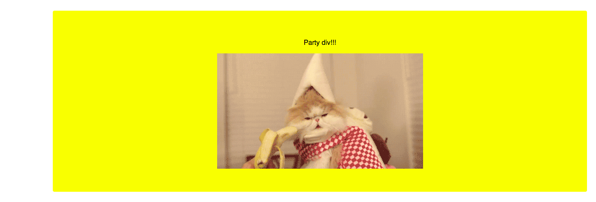
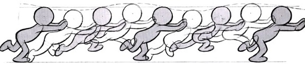
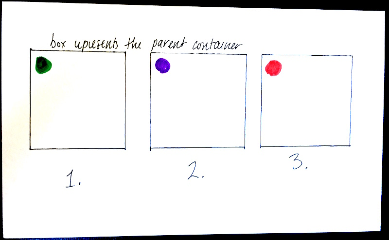

#  Transforms, Transitions & Animations 


### LEARNING OBJECTIVES
- Utilize browser compatibility techniques such as vendor prefixes, the SHIV, and meta tags.
- Describe the importance of prefixing CSS properties.
- Use properties such as transition and transform to change element properties.
- List the types of properties that can/can't be animated.
- Describe the purpose and syntax of css keyframes.
- List and describe the purpose of the animation properties.
- Compare and contrast using CSS and JS for animations.

***

<a name="introduction"></a>
## Introduction

Today we'll cover three major topics, each somewhat related:

- CSS Transforms (2D).
- CSS Transitions.
- CSS Animations.

### Vocabulary

**Transforms** are a set of CSS properties that take an element and transform its shape (e.g., rotating it, scaling it, skewing it, etc.).

**Transitions** let us tell the browser how to change a property over time. For example, if the height of an element changes (due to a :hover selector, for example), we can tell the browser to change the height gradually over one second.

**Animations** are similar to transitions, in that they make properties change over time, but they give us more control over how those changes happen. For example, we have more control over how the animation repeats, or changes between multiple values at once, etc.

**Prefixing** If you're using Chrome, you won't need to prefix any properties for this lesson; but in general, it's a good idea to check [Can I Use](http://caniuse.com/) to see if you need to use prefixes to support most users. For CSS animations, you should use prefixes to ensure support for Safari, IE, and other browsers.

## 2D Transforms

Transforms are static - immediately changing the targeted element and causing it to stay that way. The syntax for the transform property is simple – the transform property followed by the value:

```
button {
	transform: scale(1.5)
}
```

There are four main types of transformations: skew, rotate, translate, and scale.

#### Translate

The translate value works a bit like that of relative positioning, pushing and pulling an element in different directions. Using the translateX value will change the position of an element on the horizontal axis while using the translateY value will change the position of an element on the vertical axis. To set both the x and y axis values at once, use the translate value and declare the x axis value first, followed by a comma, and then the y axis value.

###### HTML

```
<div class="box-1">Box 1</div>
```

###### CSS

```
.box-1 {
  transform: translate(-10px, 25%);
}
```
##### Example: [codepen](https://codepen.io/celestelayne/pen/xBojaK?editors=0100)

#### Rotate

The rotate value provides the ability to rotate an element from 0 to 360 degrees. Using a positive value will rotate an element clockwise, and using a negative value will rotate the element counterclockwise. The default point of rotation is the center of the element, 50% 50%, both horizontally and vertically.

###### HTML

```
<div class="box-1">Box 1</div>
```

###### CSS

```
.box-1 {
  transform: rotate(20deg);
}
```
##### Example: [codepen](https://codepen.io/celestelayne/pen/QoXrBr?editors=0100)

#### Scale

Using the scale value within the transform property allows you to change the appeared size of an element. It's also possible to scale only the height or width of an element using the `scaleX` and `scaleY` values.

###### HTML

```
<div class="box-1">Box 1</div>
```

###### CSS

```
.box-1 {
  transform: scale(1.25);
}
```
##### Example: [codepen](https://codepen.io/celestelayne/pen/wOLjEP?editors=0100)

#### Skew

Skew, is used to distort elements on the horizontal axis, vertical axis, or both. To distort an element on both axes the skew value is used, declaring the x axis value first, followed by a comma, and then the y axis value.

###### HTML

```
<div class="box-1">Box 1</div>
```

###### CSS

```
.box-1 {
  transform: skew(5deg, -15deg);
}
```

##### Example: [codepen](https://codepen.io/celestelayne/pen/RdzyBo?editors=1100)

### 💥 Independent Practice -- Transforms (10 min)
1. Follow the instructions in `starter_code` > `transform_bug` > `style.css`

---

## Transitions

Transitions allow you to alter the appearance and behavior of an element whenever a state change occurs. You'll commonly see the `transition` property used on `:hover` and `:focus` states.

With transitions you determine the start and end state, the computer handles the tweening (the states in between the beginning and the end); tweening is a term from animation. You can trigger transitions by partnering your css selector with a pseudo-selector.

```css
yourSelectorHere {
	transition: [transition-property] [transition-duration] [transition-timing-function] [transition-delay];
}
```
There are two ways to trigger CSS transitions:

- Using the `:hover` CSS pseudo-class
- Adding a class with JavaScript

So, if we were trying to write a transition rule that smoothly changes the background color over 2 seconds starting 1s after the action that causes the transition, we'd write:

```
transition: background-color 2s ease 1s;
```

### Not all properties are "transitionable" or "animatable". 

Here's a table of the most common animatable & non-animatable properties.

| Animatiable                                                  | Not animatable                              |
|--------------------------------------------------------------|---------------------------------------------|
| `background-color`, `background-position`, `background-size` | `background-image`, `background-blend-mode` |
| `top`, `bottom`, `left`, `right`                             | `position`                                  |
| `height`, `width`, `min-height`, `min-width`                 | -                                           |
| `margin`, `border`, `padding`                                | `box-sizing`, `border-image`                |
| `opacity`, `visibility`                                      | `display`                                   |
| most text & font properties                                  | `font-family`                               |
| -                                                            | `float`, `clear`                            |

##### Example: [codepen](https://codepen.io/celestelayne/pen/KEjRGx?editors=1100)

### Transitions Demo
Let's look at an example of what's possible with Transitions!

Look over the following HTML and CSS, which renders as shown in the mockup below. That is one crazy cat:

```html
<body>
  <div class="party">
    <p>Party div!!!</p>
    
  </div>
</body>
```

```css
body {
  margin: 0;
  font-family: 'Open Sans', sans-serif;
  text-align: center;
  padding: 30px;
}

div {
  border: none;
  outline: none;
  background-color: #F78FA7;
  padding: 50px 20px;
  border-radius: 4px;
  margin-left: 0;
}
```


We know what we want the page to look like when the user hovers, so we can code that accordingly using the `hover` psuedo-class.

```css
div:hover {
  background-color: yellow;
  margin-left: 100px;
}
```



#### So where do we apply the `transition` CSS?
The key is to add it to `div` and not `div:hover`. That might seem counterintuitive: Don't we want the animation to happen when the user hovers? We do, but let's break down the order of events:

1. Our `<div>` is styled with the `div{ }` rule.
2. The user hovers on `<div>`.
3. `div:hover{}` styles are applied.

We can't put `transition` on `div:hover` because, when those styles are applied, the hover has *already happened*. We put the animation styles in the non-hover state of the object to *prepare* for a hover. Here is the complete CSS for the `div`:

  ```css
  div {
    border: none;
    outline: none;
    background-color: #F78FA7;
    padding: 50px 20px;
    border-radius: 4px;
    margin-left: 0;
    transition: all 2s ease-in-out;
  }

  div:hover {
    background-color: yellow;
    margin-left: 100px;
  }
  ```

In the declaration `transition: all 2s ease-in-out;` we have the following values:

- `all` means we want a transition applied to all shared properties of `div{ }` and `div:hover{ }`.
- `2s` is the total time, in seconds, it takes for the animation to occur (this can be a decimal).
- `ease-in-out` is the animation style – this means the transition will happen when the user hovers on the `div` and hovers away from the `div`.

Feel free to explore the code on your own [here](codealong/transition-example).


### 💥 Independent Practice -- Triggering Transitions (10 min)
1. Follow steps 1-2 in the `main.css` file in `starter_code` > `triggering_transitions`.
2. Follow step 3 in the `main.js` file in `starter_code` > `triggering_transitions`.

## Animations

With animations, you determine as many states as you want (the beginning, the end and the in-between) - the computer still tweens between those steps. Rather than using a pseudo-selector, animations have a partner rule called `@keyframes`.

Animations happen on page load. The number of iterations can be determined.

If you want an animation to start based on some activity (e.g. the click of a button), you can with JavaScript. On a click (or whatever the event listener is placed upon) – add the class of the element. To stop or switch animations, remove the class and put on a new one.

#### What is a keyframe?



Keyframes are a common animation concept, usually found in hand-drawn animation. In the above image, the figures in grey are keyframes - they define the starting, ending, or middle point of a smooth transition. The other drawings are inbetweens - they don't have to be drawn on a storyboard, because the animator can assume what they will look like without a visual reference.

In web-based animations, keyframes work the same way - they represent the begining, ending, or midpoint state of the element being animated. However, our inbetweens will be generated by code, instead of being filled in by hand later.

The `transition` property allows us to define a beginning and end point for a state change. However, sometimes you'll want to have an element move through multiple states during an animation. That's where the CSS keyframes rule comes in.

Keyframe syntax uses `@`. Let's take a look at the bare bones of a keyframe rule:

```
/* keyframes keyword, animation name */
@keyframes ANIMATION-NAME {
  /* description of the animation */
  0% {
    /* the beginning state of the animation */
    property: first-value;
  }
  50% {
    /* the middle state of the animation */
    /* you can have as many mid-points as you want,
       at whatever percentages you want. */
    property: second-value;
  }
  100% {
    /* the ending state of the animation */
    property: third-value;
  }
  /* In order for anmiations to happen smoothly, you must
     animate the same property at every animation !! 
     For example, to smoothly animate a circle from left to right,
     you wouldn't do `left: 0%;` and then `right: 0%;`. You have
     to keep animating `left`. */
}
```
And here is how you apply an animation rule to a CSS class:

```css
.animate-me {
  animation: ANIMATION-NAME [duration] [timing-function] [delay]
}

  /* This is sort of like the transition property shorthand: each of these does a different thing.
     - animation-name: specifies the name of the keyframe rule
     - animation-duration: specifies the number of seconds or milliseconds
     - animation-timing-function: specifies the "speed curve" of the animation
     - animation-delay: specifies a delay before the animation will start
     - animation-iteration-count: specifies how many times an animation should be played
     - animation-direction: specifies whether or not an animation should be played in reverse on alternate cycles
     - animation-fill-mode: specifies what values are applied by the animation outside the time it is executing
     - animation-play-state: specifies whether the animation is running or paused
  */
```

### Animation Demo

Let's animate this drawing together. This example has been pseudo-coded because it's good practice to get used to thinking about small problems in this way. Breaking up large problems into small pieces will be easier down the line.
     

| Keyframes Drawing                    | Description                                                                                                                                             | Expected property value                                                                                             |
|--------------------------------------|---------------------------------------------------------------------------------------------------------------------------------------------------------|---------------------------------------------------------------------------------------------------------------------|
|  | <ul><li>The circle does not move at any point.</li> <li>At first the circle is green</li> <li>Then it is purple.</li> <li>Finally, it is red.</li></ul> | <ol><li>`background-color: green;`</li> <li>`background-color: purple;`</li> <li>`background-color: red;`</li></ol> |

### Writing pseudo code for interactions

- Find a group! Groups should be 3 or 4 people tops. You can also work in pairs.
- Create a fork of [this codepen](http://codepen.io/jlr7245/pen/BWgvxo?editors=1100).
- Come up and get an index card with an animation drawn on it!
- Write out the steps you think the animation will need.
- Make the animation happen! 

Steps to write pseudo code:

1. What actions are we waiting for the user to take? (click, scroll, submit, keydown, etc.)?
2. Is there css we can add to our stylesheet and then add or remove a class?
3. Do we need any logic (if / else statements)?

---

### 💥 Independent Practice -- Modal Window
1. Open the `starter code > modal_window` in your text editor.
2. Follow the instructions in your `main.css` file
3. Write your pseudo code for the close and open buttons
4. Write your JavaScript

### 💥 Independent Practice -- Sidebar Menu
1. Open the `starter code > sidebar_menu` in your text editor.
2. Turn and Talk: Chat through how to tackle this interaction with a partner
3. Follow the instructions in `main.css` to make the menu interactive. One step will require writing JS
4. BONUS: Also move the `.content` section over when the hamburger icon is clicked.

### 💥 Independent Practice -- Sticky Nav
1. Open the `starter code > sticky_nav` in your text editor.
2. Review these links: [find out how far down the page the nav is](https://stackoverflow.com/questions/7778580/how-to-find-the-vertical-distance-from-top-in-px-of-an-element-using-jquery) and [find out how far the user has scrolled](https://stackoverflow.com/questions/1283040/how-can-you-use-jquery-measure-how-far-down-the-user-has-scrolled).
3. Write pseudo code in `main.js`
4. Follow the instructions in `main.css` to make the sticky nav functional.
5. Bonus: Fade in the annotations. Bonus: use `setTimeout` (Google it) to stagger the animations.

***

### 💥 Independent Practice: Research Transforms, Transitions, and Animations (20 mins)
Break into groups of four. Each group will have 20 minutes to prepare a short explanation/demo of their assigned topic. Your demos should take no longer than five minutes.

| Group | Topic
| --- | --- |
| 1 | [CSS Transforms (No animation)](https://developer.mozilla.org/en-US/docs/Web/CSS/transform) |
| 2 | [CSS Transitions](https://developer.mozilla.org/en-US/docs/Web/CSS/transition) |
| 3 | [CSS Animations (basic keyframes and syntax)](https://developer.mozilla.org/en-US/docs/Web/CSS/@keyframes) |
| 4 | [CSS Animations (timing functions)](https://developer.mozilla.org/en-US/docs/Web/CSS/animation-timing-function) |
| 5 | [CSS Animations (iterations / repeats / direction )](https://developer.mozilla.org/en-US/docs/Web/CSS/animation-iteration-count) |

***

<a name="ind-practice"></a>
### 💥 Independent Practice: Animate It! 
Implement as many of the following exercises as you can in the time allotted. Feel free to work with a partner!

- [Loader Animation](independent-practice/loader-animation/starter-code)
- [Spinning Wheel Animation](independent-practice/spinning-wheel-animation/starter-code)
- [Transition Button Animation](independent-practice/transition-button-animation/starter-code)

#### Bonus
- [CSS Accordion](independent-practice/accordian-animation)
- [Clock](independent-practice/clock-animation)

### 💥 Independent Practice: Choose Your Own Adventure
You can work on your own, in pairs, or in groups of three. Here are your options:

- Add another planet or two to the solar system we've been building!!
- Interested in how CSS animations can be used for microinteractions? I'll be doing a mini-lecture on that, based on a [dot wiggler](http://codepen.io/jlr7245/pen/zZemXE) I've been testing out.
- Get another index card and test out your skills with the `transform` property!!!
- Dig into one of the following examples & see if you can understand how it works. Any questions? Ask!
    - [Day Night Simulation](http://codepen.io/Catagen/pen/PqYdXR/)
    - [Flat design camera](http://codepen.io/damienpm/pen/esoJG/)
    - [Full CSS 3D Solar System](http://codepen.io/waynedunkley/pen/YPJWaz/?editors=1100)


## Conclusion 
#### CSS vs. JS Animations
CSS Animations are easy and mostly compatible, so they're often a good choice for basic animation needs. For anything more complex, such as animation that depends on user input, you'll need to use Javascript. There are good libraries for animation, such as [GSAP (Greensock Animation Platform)](http://greensock.com/gsap).

***

## Additional Resources
#### Reading & Libraries
- [An introduction to animations with Greensock Animation API](https://zellwk.com/blog/gsap/), an animation library that helps you create performant animations.
- [Animate.css](https://daneden.github.io/animate.css/)
- [Hover.css](https://github.com/IanLunn/Hover)
- [Lottie](https://github.com/airbnb/lottie-web) by AirBnB

#### Exercises
- [CSS Ghost](exercises/css-ghost)


#### Videos
- [CSS Animation](https://www.youtube.com/watch?v=9RfHG3K8U_Q&index=31&list=PLdnONIhPScST0Vy4LrIZiYKpFNoxgyH7J)
- [CSS Transitions](https://www.youtube.com/watch?v=Xu3SrQhtBqw&index=30&list=PLdnONIhPScST0Vy4LrIZiYKpFNoxgyH7J)
- [CSS Transform](https://www.youtube.com/watch?v=Gu-HBBZLyjg&index=29&list=PLdnONIhPScST0Vy4LrIZiYKpFNoxgyH7J)
